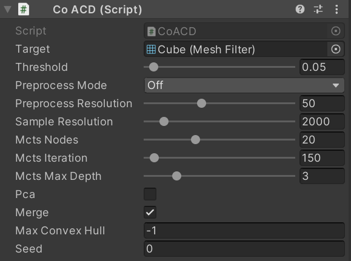
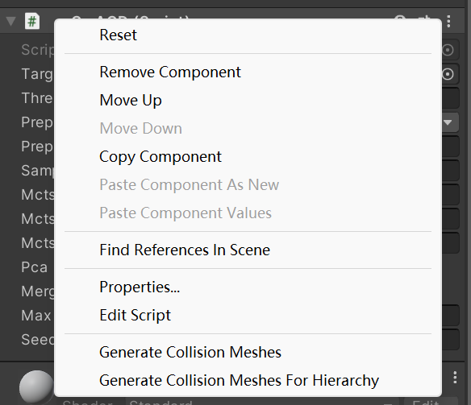
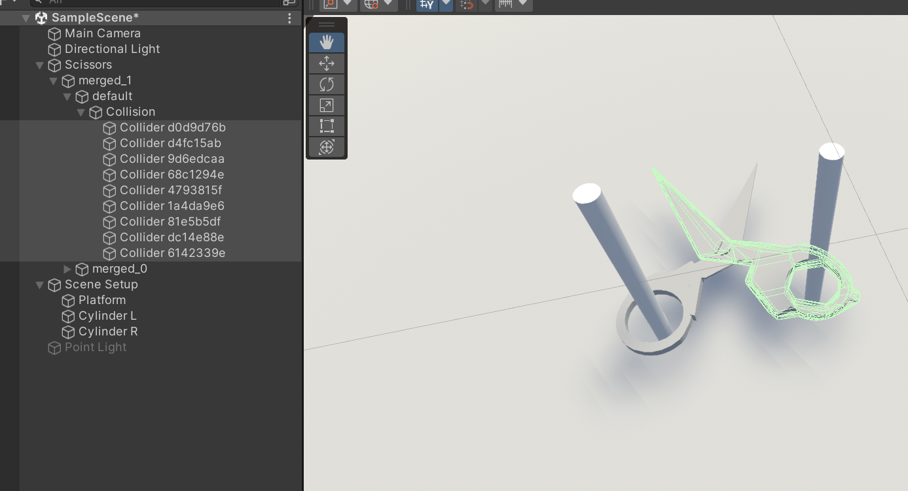

# Approximate Convex Decomposition for 3D Meshes with Collision-Aware Concavity and Tree Search [SIGGRAPH2022]
 [\[project\]](https://colin97.github.io/CoACD/) [\[paper\]](https://arxiv.org/pdf/2205.02961.pdf) [\[video\]](https://www.youtube.com/watch?v=r12O0z0723s)

 [](https://github.com/SarahWeiii/CoACD/actions/workflows/build.yml)
 

[***News***] CoACD (both Python and C++) is supported on Linux (x86_64), Windows (amd64) and MacOS (x86_64 & apple sillicon) now!

[***News***] CoACD is now supported in Unity as a package!

[***News***] CoACD adds "auto" pre-processing mode, which produces better results for manifold meshes!

Approximate convex decomposition enables efficient geometry processing algorithms specifically designed for convex shapes (e.g., collision detection). We propose a method that is better to preserve collision conditions of the input shape with fewer components. It thus supports delicate and efficient object interaction in downstream applications.


## PyPI

### (1) Installation

```
pip install coacd
```

### (2) Usage
```
import coacd

mesh = trimesh.load(input_file, force="mesh")
mesh = coacd.Mesh(mesh.vertices, mesh.faces)
parts = coacd.run_coacd(mesh) # a list of convex hulls.
```
The complete example script is in `python/package/bin/coacd`, run it by the following command:
```
cd python
python package/bin/coacd -i $InputFile -o $OutputFile
```

## Unity

Supporting Unity 2020.1 or later.
See the example project in [`unity` branch](https://github.com/SarahWeiii/CoACD/tree/unity).

<video src="https://github.com/SarahWeiii/CoACD/assets/23738781/bda0e0bb-b55c-4ccc-b6df-33d09a2bd7c2" controls="controls" style="max-width: 400px;" autoplay>
</video>

### (1) Installation

1. Open the Package Manager from `Window` -> `Package Manager`.
2. Find and click the + button in the upper lefthand corner of the window. Select `Add package from git URL`.
3. Enter the following URL:
```
https://github.com/SarahWeiii/CoACD.git?path=/Packages/info.flandre.coacd#unity
```
4. Click `Add`.

### (2) Usage

1. Add a `CoACD` component to your object. You can tweak the parameters in the editor.



2. Right click the component header lane. Then select `Generate Collision Meshes` or
   `Generate Collision Meshes for Hierarchy` to generate collision for the current object or
   all children of the current object that contains a `MeshFilter`, respectively.



3. Unity mesh colliders will be created in the scene under `Collision` as a child of each object.



4. Alternatively, you can call the runtime API as a method of the `CoACD` component:

```csharp
public List<Mesh> RunACD(Mesh mesh);
```

## Compile from source

### (1) Clone the code

```
git clone --recurse-submodules https://github.com/SarahWeiii/CoACD.git
```

### (2) Dependencies
Install dependencies: `git` and `cmake >= 3.24`.
Recommended compilers: Linux `g++ >= 9, < 12`; `clang` on MacOS `10.14` or higher; `MSVC 2019/2022` on Windows.

### (3) Compile

First create the build directory:

```
cd CoACD \
&& mkdir build \
&& cd build \
```

Then run `cmake`. On Linux and MacOS:

```
cmake .. -DCMAKE_BUILD_TYPE=Release \
&& make main -j
```

On Windows (MSVC):

```
cmake .. -DCMAKE_BUILD_TYPE=Release -DCMAKE_MSVC_RUNTIME_LIBRARY=MultiThreaded -DOPENVDB_CORE_SHARED=OFF -DTBB_TEST=OFF -DCMAKE_CXX_FLAGS="/MT /EHsc"
cmake --build . --target main --config Release
```

### (4) Quick start
We provide a set of default parameters, and you only need to specify the input and output path. You can take an arbitrary mesh as input (in `.obj` format, no need to be a manifold) and run the algorithm by the following command:
```
./main -i PATH_OF_YOUR_MESH -o PATH_OF_OUTPUT
```

The generated convex components (in both `.obj` and `.wrl` formats) will be saved in PATH_OF_OUTPUT.

## Examples

We provide some example meshes and a `run_example.sh`, and the results will be saved in the `outputs` folder.
```
bash run_example.sh
```
* You can adjust the threshold by `-t` to see results with different quality.
* Three of the examples are from [PartNet-M](https://sapien.ucsd.edu/browse) (Bottle.obj, Kettle.obj, KitchenPot.obj), which are non-manifold. Two of them are from [Thingi10K](https://ten-thousand-models.appspot.com/) (Octocat-v2.obj, SnowFlake.obj), which are both 2-manifold.

## Parameters

Here is the description of the parameters (sorted by importance).

* `-i/--input`: path for input mesh (`.obj`).
* `-o/--output`: path for output (`.obj` or `.wrl`).
* `-ro/--remesh-output`: path for preprocessed mesh output (`.obj`).
* `-pr/--prep-resolution`: resolution for manifold preprocess (20~100), default = 50.
* `-t/--threshold`:  concavity threshold for terminating the decomposition (0.01~1), default = 0.05.
* `-pm/--preprocess-mode`: choose manifold preprocessing mode ('auto': automatically check input mesh manifoldness; 'on': force turn on the pre-processing; 'off': force turn off the pre-processing), default = 'auto'.
* `-nm/--no-merge`: flag to disable merge postprocessing, default = false.
* `-c/--max-convex-hull`: max # convex hulls in the result, -1 for no maximum limitation, works **only when merge is enabled**, default = -1 (may introduce convex hull with a concavity larger than the threshold)
* `-mi/--mcts-iteration`: number of search iterations in MCTS (60~2000), default = 100.
* `-md/--mcts-depth`: max search depth in MCTS (2~7), default = 3.
* `-mn/--mcts-node`: max number of child nodes in MCTS (10~40), default = 20.
* `-r/--resolution`: sampling resolution for Hausdorff distance calculation (1e3~1e4), default = 2000.
* `--pca`: flag to enable PCA pre-processing, default = false.
* `-k`: value of $k$ for R_v calculation, default = 0.3.
* `-d/--decimate`: enable max vertex constraint per convex hull, default = false.
* `-dt/--max-ch-vertex`: max vertex value for each convex hull, **only when decimate is enabled**, default = 256.
* `-am/--approximate-mode`: approximation shape type ("ch" for convex hulls, "box" for cubes), default = "ch".
* `--seed`: random seed used for sampling, default = random().

An example of changing the parameters:
```
./main -i PATH_OF_YOUR_MESH -o PATH_OF_OUTPUT -t 0.05 -mi 200 -md 4 -mn 25
```

Parameter tuning *tricks*: 
1. In most cases, you only need to adjust the `threshold` (0.01~1) to balance the level of detail and the number of decomposed components. A higher value gives coarser results, and a lower value gives finer-grained results. You can refer to Fig. 14 in our paper for more details.
2. If your input mesh is not manifold, you should also adjust the `prep-resolution` (20~100) to control the detail level of the pre-processed mesh. A larger value can make the preprocessed mesh closer to the original mesh but also lead to more triangles and longer runtime.
3. The default parameters are fast versions. If you care less about running time but more about the number of components, try to increase `searching depth (-md)`, `searching node (-mn)` and `searching iteration (-mi)` for better cutting strategies.
4. Make sure your input mesh is 2-manifold solid if you want to use the `-np` flag. Skipping manifold pre-processing can better preserve input details, but please don't specify the `-np` flag if your input mesh is non-manifold (the algorithm may crush or generate wrong results).
5. `--seed` is used for reproduction of the same results as our algorithm is stochastic.

## Citation

If you find our code helpful, please cite our paper:

```
@article{wei2022coacd,
  title={Approximate convex decomposition for 3d meshes with collision-aware concavity and tree search},
  author={Wei, Xinyue and Liu, Minghua and Ling, Zhan and Su, Hao},
  journal={ACM Transactions on Graphics (TOG)},
  volume={41},
  number={4},
  pages={1--18},
  year={2022},
  publisher={ACM New York, NY, USA}
}
```
