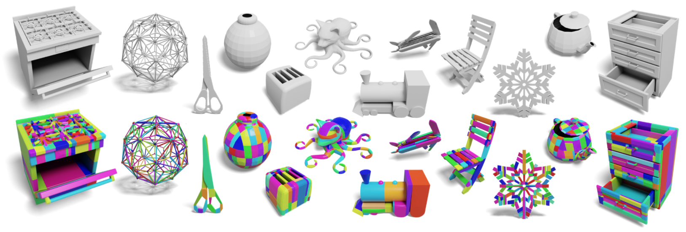

# Approximate Convex Decomposition for 3D Meshes with Collision-Aware Concavity and Tree Search [SIGGRAPH2022]
 [\[project\]](https://colin97.github.io/CoACD/) [\[paper\]](https://arxiv.org/pdf/2205.02961.pdf)

Approximate convex decomposition enables efficient geometry processing algorithms specifically designed for convex shapes (e.g., collision detection). We propose a method that is better to preserve collision conditions of the input shape with fewer components. It thus supports delicate and efficient object interaction in downstream applications.



## Usage

### (1) Clone the code

```
git clone --recurse-submodules https://github.com/SarahWeiii/CoACD.git
```

### (2) Compile

```
cd CoACD
mkdir build
cd build
cmake .. -DCMAKE_BUILD_TYPE=Release
make
```

### (3) Quick start
We provide a set of default parameters, and you only need to specify the input and output path. You can take an arbitrary mesh as input (in `.obj` format, no need to be a manifold) and run the algorithm by the following command:
```
./main -i PATH_OF_YOUR_MESH -o PATH_OF_OUTPUT
```

The running log and the generated convex components (in both `.obj` and `.wrl` formats) will be saved in PATH_OF_OUTPUT.


## Parameters

Here is the description of the parameters (sorted by importance).

* `-i/--input`: path for input mesh (`.obj`).
* `-o/--output`: path for output (`.obj` or `.wrl`).
* `-l/--log`: path for output logfile, default = same_path_as_output_components.
* `-t/--threshold`:  concavity threshold for terminating the decomposition (0.01~1), default = 0.05.
* `-np/--no-prerpocess`: flag to disable manifold preprocessing, default = false. If your input is already manifold mesh, disabling the preprocessing can avoid introducing extra artifacts.
* `-nm/--no-merge`: flag to disable merge postprocessing, default = false.
* `-mi/--mcts-iteration`: number of search iterations in MCTS (60~2000), default = 100.
* `-md/--mcts-depth`: max search depth in MCTS (2~7), default = 3.
* `-mn/--mcts-node`: max number of child nodes in MCTS (10~40), default = 20.
* `-pr/--prep-resolution`: resolution for manifold preprocess (1e3~1e5), default = 1e4.
* `-r/--resolution`: sampling resolution for Hausdorff distance calculation (1e3~1e4), default = 2000.
* `-k`: value of $k$ for $\operatorname{R_v}$ calculation, default = 0.3.
* `--pca`: flag to enable PCA pre-processing, default = false.
* `--seed`: random seed used for sampling, default = random().

A example of changing the parameters:
```
./main -i PATH_OF_YOUR_MESH -o PATH_OF_OUTPUT -t 0.05 -mi 200 -md 4 -mn 25
```

Parameter tuning *tricks*: 
1. In most cases, you only need to adjust the `threshold` (0.01~1) to balance the level of details and the number of decomposed components. A higher value gives coarser results, and a lower value gives finer-grained results. You can refer to Fig. 14 in our paper for more details.
2. The default parameters are fast versions. If you care less about running time but more about the number of components, try to increase `searching depth (-md)`, `searching node (-mn)` and `searching iteration (-mi)` for better cutting strategies.
3. `-pr` controls the quality of manifold preprocessing. A larger value can make the preprocessed mesh closer to the original mesh but also lead to more triangles and longer runtime.
4. Make sure your input mesh is 2-manifold solid if you want to use the `-np` flag. Skipping manifold pre-processing can better preserve input details, but please don't specify the `-np` flag if your input mesh is non-manifold (the algorithm may crush).
5. `--seed` is used for reproduction of same results as our algorithm is stochastic.

## Examples

We provide some example meshes and a `run_example.sh`, and the results will be saved in the `outputs` folder.
```
bash run_example.sh
```
* You can adjust the threshold by `-t` to see results with different quality.
* Three of the examples are from [PartNet-M](https://sapien.ucsd.edu/browse) (Bottle.obj, Kettle.obj, KitchenPot.obj), which are non-manifold. Two of them are from [Thingi10K](https://ten-thousand-models.appspot.com/) (Octocat-v2.obj, SnowFlake.obj), which are both 2-manifold.

## License

Copyright (c) 2022 Xinyue Wei, Minghua Liu

Please note our code utilizes [ManifoldPlus](https://github.com/hjwdzh/ManifoldPlus), which is distributed for free for non-commercial use only. But ManifoldPlus is only used for pre-processing thin objects which cannot be well solved by Manifold. If you don't have non-manifold thin objects, you can **diable** this library by `--no-manifold-plus` or `-nmp`. 

## Citation

If you find our code helpful, please cite our paper:

```
@article{wei2022approximate,
  title={Approximate Convex Decomposition for 3D Meshes with Collision-Aware Concavity and Tree Search},
  author={Wei, Xinyue and Liu, Minghua and Ling, Zhan and Su, Hao},
  journal={arXiv preprint arXiv:2205.02961},
  year={2022}
}
```
